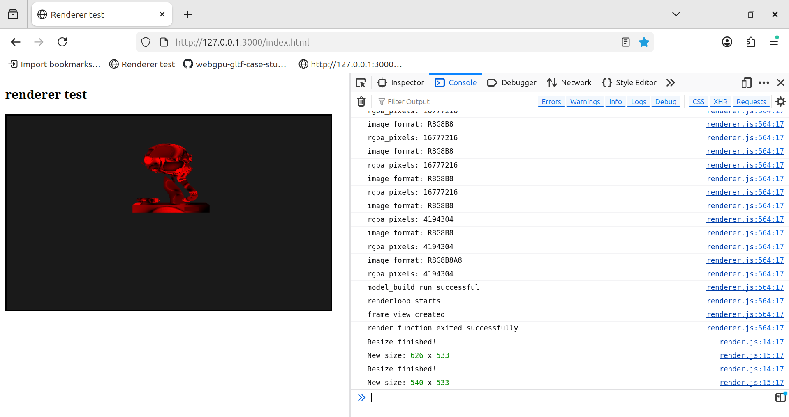

# Rust wasm32 (Web-Assembly) tool that uses client side GPU for rendering a 3d model on website using W-GPU / WEB GPU

## Generic Flow
1) Javascript's ***fetch api*** is used to load the ***.glb*** model from the server
2) The loaded model is read into *typed array* **Uint8Array**  which are basically the bytes in the model
3) The **wgpu** crate is used to load the model into the client web browser rendered using client's hardware off-loading the weight from server the output of entire stages is presented via **web_sys::console;**
## Crates used :
### 1) wasm-bindgen
 Connects Rust and JavaScript by generating bindings so Rust functions and types can be called from JS (and vice versa).

### 2) wasm-bindgen-futures
Bridges Rust async futures with __JavaScript’s Promise API__ for async inter-operation in WebAssembly.

### 3) wgpu (features=["webgpu"])
Cross-platform GPU abstraction (WebGPU backend) for rendering to web.

### 4) console_error_panic_hook
Prints Rust panic messages to the browser console instead of silently failing in WebAssembly.

### 5) gltf
Loads and parses glTF 3D models (geometry, materials, scenes) into usable Rust structures.

### 6) bytemuck
Represents rust data in C data with similar data padding, alternate to __std::ffi__.
 Safely casts plain data structures (like vertices) to and from raw bytes for GPU or binary operations.